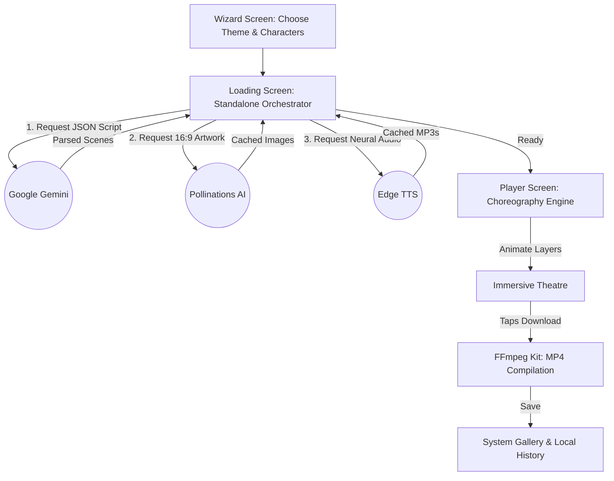

# Toto AI Video Generation Platform 🧸📽️

**Toto** is a standalone, serverless Flutter application that transforms simple story ideas into high-quality, animated cinematic videos. Built with a focus on ease-of-use and technical excellence, Toto orchestrates multiple cloud AI services directly from the mobile device to write, illustrate, narrate, and compile custom 1-minute educational stories.

---

## ✨ Core Features

- **Standalone AI Orchestration:** No backend required. The app communicates directly with Google Gemini and Pollinations AI.
- **Cinematic Landscape Movie:** Immersive full-screen 16:9 playback with automatic orientation locking.
- **Dynamic Storytelling:** Generates 10 distinct scenes (approx. 60 seconds total) based on user-selected characters and themes.
- **High-Fidelity Visuals:** Pollinations AI generates custom 1280x720 illustrations with characters naturally merged into cohesive backgrounds.
- **Neural Narrator:** Professional, human-like voiceovers using Microsoft Edge TTS (Child voices for toddler stories, Adult voices for others).
- **Interactive Player:** Draggable progress slider, dual-timer display, and a "Watch Again" replay feature.
- **Local MP4 Export:** Programmatically compile and download your story into a real video file saved directly to your **System Gallery**.
- **Story History:** Keep track of all your previously generated masterpieces in a local persistent history list.

---

## 🚀 Tech Stack

- **Framework:** Flutter (Android/iOS)
- **Script Generation:** Google Gemini 1.5 Flash
- **Image Generation:** Pollinations AI (Flux Model)
- **Voice Synthesis:** Edge TTS (via `edge_tts`)
- **Video Export:** FFmpeg Kit (via `ffmpeg_kit_flutter_new`)
- **Animations:** `flutter_animate` (Choreography Engine)
- **Media Engine:** `audioplayers` & `video_player`
- **Gallery Integration:** `gal`

---

## 🛠️ System Architecture



---

## 📦 Getting Started

### 1. Prerequisites
- **Flutter SDK** (Stable channel)
- **Google Gemini API Key** (Get it for free at [aistudio.google.com](https://aistudio.google.com/app/apikey))

### 2. Setup Secrets
To keep your API keys secure, Toto uses `dart-define-from-file`.
1. Create a file named `secrets.json` in the project root:
   ```json
   {
     "GEMINI_API_KEY": "YOUR_AIza_KEY_HERE"
   }
   ```
2. The `secrets.json` file is already added to `.gitignore` to prevent accidental exposure.

### 3. Run the App
Connect your physical phone and run:
```bash
flutter run --dart-define-from-file=secrets.json
```

---

## 📽️ Generation Presets

Toto currently supports four major story archetypes:
- **Child Story:** Uses a child-like narrator (`en-US-AnaNeural`) and adorable cartoon art.
- **Sci-Fi Adventure:** Cinematic space visuals and professional adult narration.
- **Mystery Tale:** High-contrast atmospheric artwork.
- **Nature Discovery:** Educational focus on animals and environments.

---

## 🔒 Security & Best Practices

- **API Key Injection:** Keys are injected at build-time using environment variables, never hardcoded in source files.
- **Obfuscation:** Release builds are configured with `--obfuscate` to scramble the binary and protect embedded logic.
- **CI/CD Automation:** Includes a GitHub Action workflow ([`.github/workflows/release.yml`](.github/workflows/release.yml)) that automatically builds and creates a GitHub Release with an APK whenever a version tag (e.g., `v1.0.0`) is pushed.

---

## ❤️ Vision
Toto is designed to show that mobile hardware is capable of complex media orchestration. By removing the need for expensive backend rendering servers, Toto provides a free, private, and unlimited way to create educational content for everyone.

> **Create. Animate. Export. All on your phone.**
